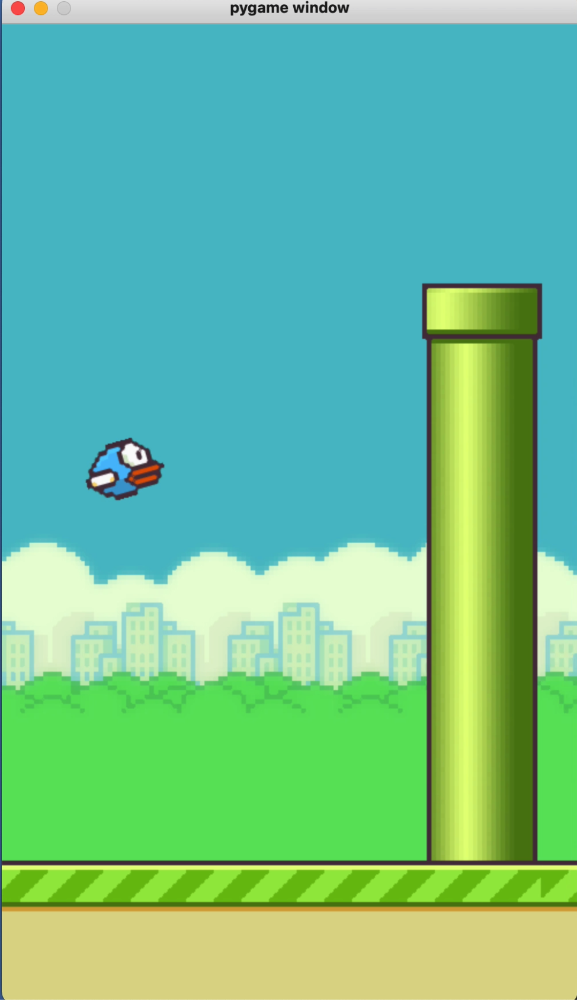
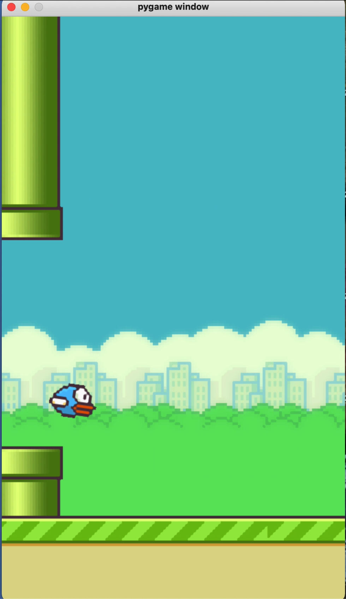

# OVERVIEW
This is a traditional flappy bird game that is built using pygame library. Designed with python, pygame, and github.

# DEVELOPMENT ENVIRONMENT
* PyCharm

# EXECUTION
Install pygame on Windows using the command: py -m pip install -U pygame --user
Install pygame on Mac using the command: python3 -m pip install -U pygame --user
To execute the program: run the program with an IDE or use the command, python3 flappy.py.

# USEFUL WEBSITES
* [Pygame Documentation](https://www.pygame.org/docs/)
* [Pygame tutorial Tutorials](https://realpython.com/pygame-a-primer/)

# Tutorial Credit
* [Clear Code](https://twitter.com/clear_coder)
